# TRY YOUR LUCK
___

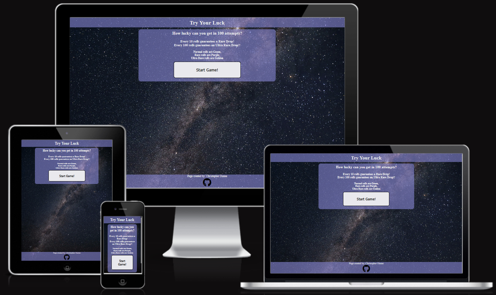

This website is a simple lottery styled game. This site is targeted towards people who enjoy games of chance such as slots or gambling and to appeal to users who may enjoy card pack openings such as with trading Card or Sports games.

# Five UX Planes

## Strategy

Users want to be presented clear unambigous rules for the operation and mechanics of the game. 
Users want to be shown the results of every roll they make. 
Users want a clear indication in the difference of their roll results. 
Users want to be able to see their roll progress. 
Users will want to be able to quickly reset to try again. 
Users want a simple, no-nonsense, presentation that doesn't distract from the main focus of the game. 

## Scope

The site should be clean and simple and consistent across all devices. 
The site should have clearly defined UI elements. 
The site should present the rules and mechanics up front. 
The site should have its main focus be on the two buttons for rolling. 
The site should have counters to track all rolls. 
The site should clearly present results of varying rarity. 
The site should have a reset button. 
The site should be unobtrusive but attractive. 

## Structure

The achieve the above scope the structure of the webpage should consist of just one webpage. 
The page will have a header with the title. 
The page will have a footer with the creator and a link to their account. 
The page will have multiple divs that are shown and hidden as needed. 
It should display a simple welcome div that introduces the user to the rules and mechanics. 

### Intro Div

This div should be hidden when the user progresses, displaying divs for the game and result areas. 
This div should have a simple confirmation button for the user to progress after reading the rules. 

### Game Div

The game div should have buttons and counters to roll and track a users number of rolls. 
This div should have 2 buttons for single and multiple rolls. 
There should be counters for overall rolls. 
There should be counters to track number of rolls until guaranteed rarities. 

### Result Div

The result area should be empty and populate with each result as a user presses buttons in the game div. 
The result div should contain a reset button to set the game back to its beginning state. 

## Skeleton

The design and flow of the website remains consistent and clean. 
There is little change in the presentation of the website across various devices, save for some small resizing of elements. 
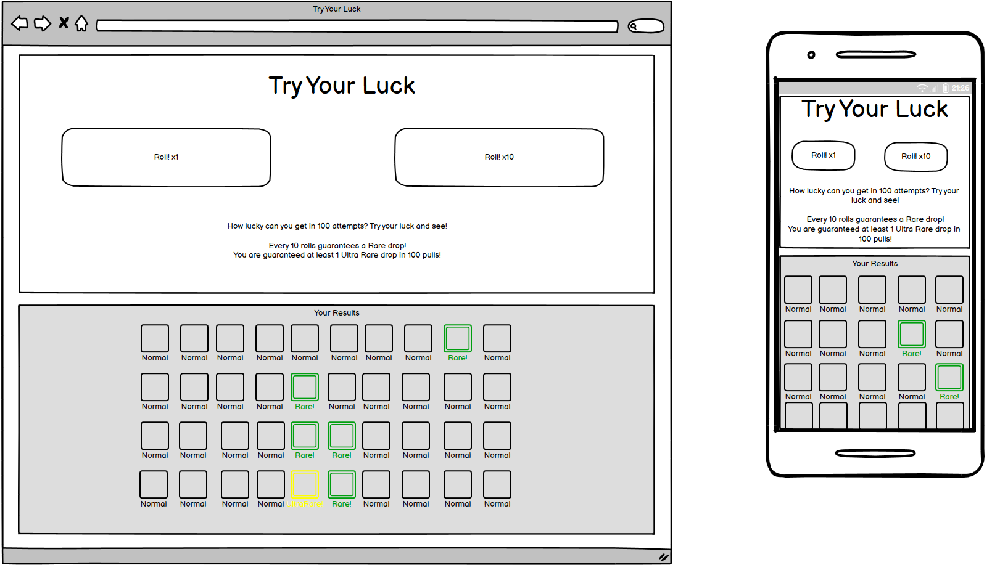

## Surface

I wanted everything on the site to be clear and bright. 
I chose a faded purple colour for the primary colour of the site. 
I chose to use a white colour for the text to stand against the dark background. 
The buttons follow a similar premise being primarily white and black to have suitable contrast. 
I chose a starry night background as I felt it provided a similar feel to the lights of somewhere like Las Vegas wihtout being too bright or distracting. 

# Features

## Header

The header simply contains the title of the Webpage/Game.

## Intro Div

The intro div acts as a welcoming splashscreen to the user. 
It offers a quick overview of how the game works. 
It has a button to start the game, at which point the div is hidden and the game divs are shown. 
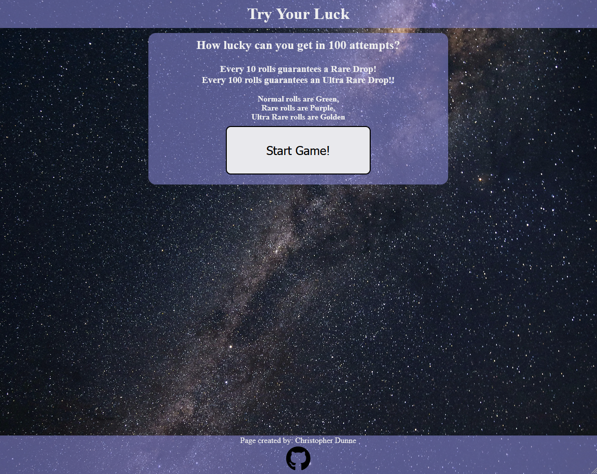

## Button Div

The button div contains two buttons: Roll x1 and ROll x10. 
Both buttons will execute JS code to pull a randomly selected reward or rewards and add them to the results div. 
The button div also holds three counters. 
One counter displays how many remaining rolls a user has. 
Another displays how many rolls a user has until the next "Rare" drop they will receive. 
The last counter displays how many rolls a user has until the next "Ultra Rare" drop they will receive. 
Once the user has used all of their rolls a dialog will display informing them and asking them to reset the game. 
This will also disable the both buttons to prevent further attempts. 
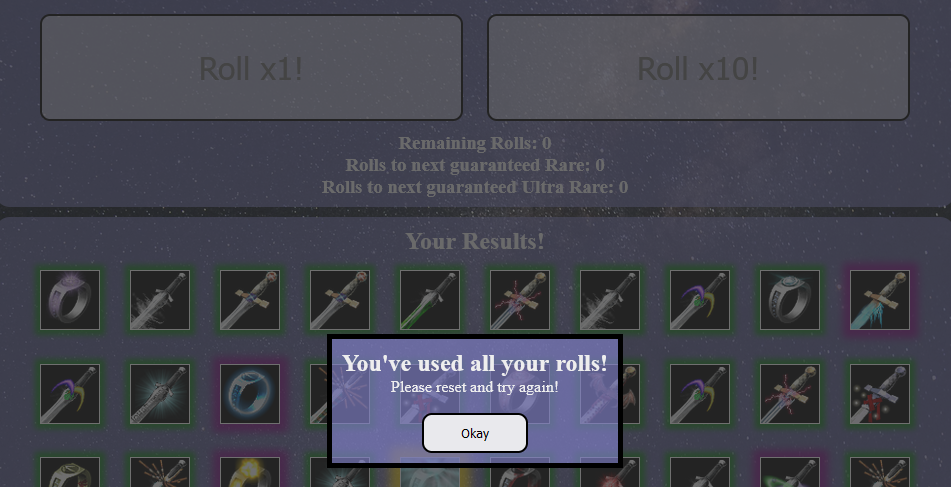

## Results Div

This div is mostly empty at first, containing only a small header and a reset button. 
As the user pressed the buttons in the Button-div this div will populate with the random rolls they have received. 
The reset button will empty the div back to its default state and also reset the three counters in the button div. 
If the user has prompted the dialog popup the Reset button will reactivate both Roll buttons. 
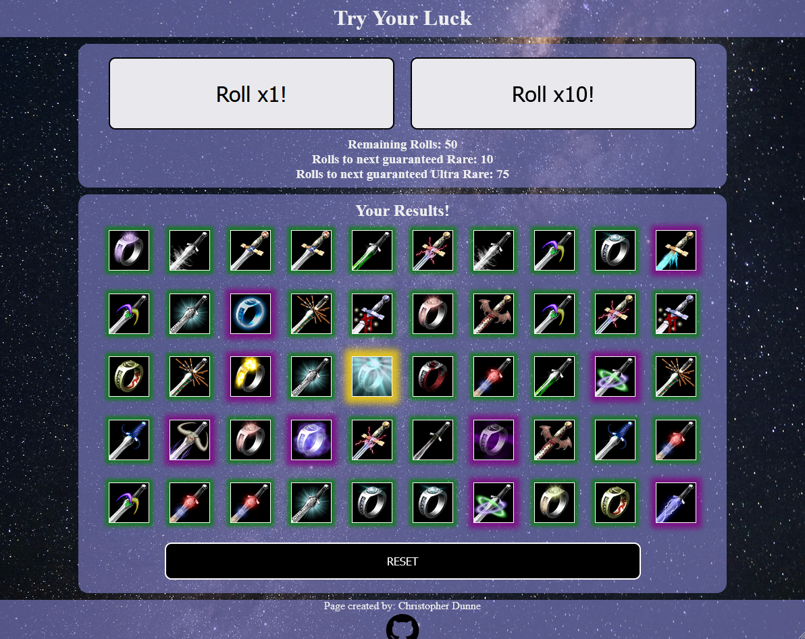

## Footer

The footer quite simply contains my name as the creator and a GitHub icon linking to my account. 
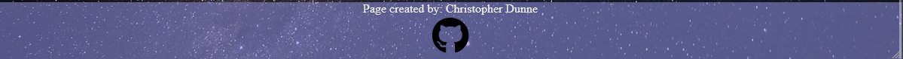

## Features Left to Implement

All features were implemented as planned, however there are possible additions that could be made. 
Possible future additions to the game may include: 
1. A gallery page, which a user could use to view all possible results. 
This page could have a display of all rolls shadowed out, which then get unshaded when a user receives them through rolling.
2. A system to prevent receiving the same "Ultra Rare" drop twice in a row in one set of 100 pulls if the user was lucky enough to receive them.
3. The ability to bring up the intro div again if a user needs to double check the rules.

# Testing

There were multiple stages of testing as the project developed. 

|TEST|PROCESS|EXPECTATION|RESULT|
|--|--|--|--|
| HTML & CSS Positioning | Webpage resized to various devices | Elements would correctly adjust | SUCCESS |
| Roll Button Functionality | Button clicks | Elements would be created on click | SUCCESS |
| Reward Div Creation | After Button clicks | Element would be added to correct area as children | SUCCESS |
| Multiple Reward Div Creation | After Button clicks | Element would be added continually | SUCCESS |
| Roll Counter Testing | After Button clicks | All counters would correctly decrease or reset as required | SUCCESS |
| Reset Button Functionality | Button click | Reward Area would return to default state. Counters would reset. | SUCCESS  |
| Luck Calculation | Repeated runs of the Game | Rare and Ultra Rare drops would be rewarded as expected | SUCCESS  |
| Guarantee Confirmation | Repeated runs of the Game | Rare and Ultra Rare drops would be rewarded when guaranteed | SUCCESS  |
| Reward Image Confirmation | Repeated runs of the Game | Images would load into the reward divs correctly | SUCCESS  |
| Reward Image Randomisation | Repeated runs of the Game | Images would load randomly | SUCCESS  |
| Reward Image Rarity | Repeated runs of the Game | Images would load according to the corresponding rarity of the reward | SUCCESS  |

# Validating

## HTML

I have run the html through the validator and it is fully valid. 
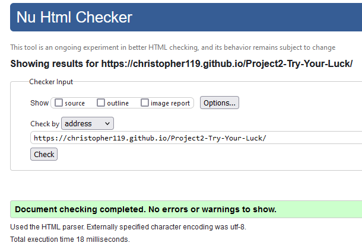

## CSS

I have run the css stylesheet through the validator and it is fully valid. 
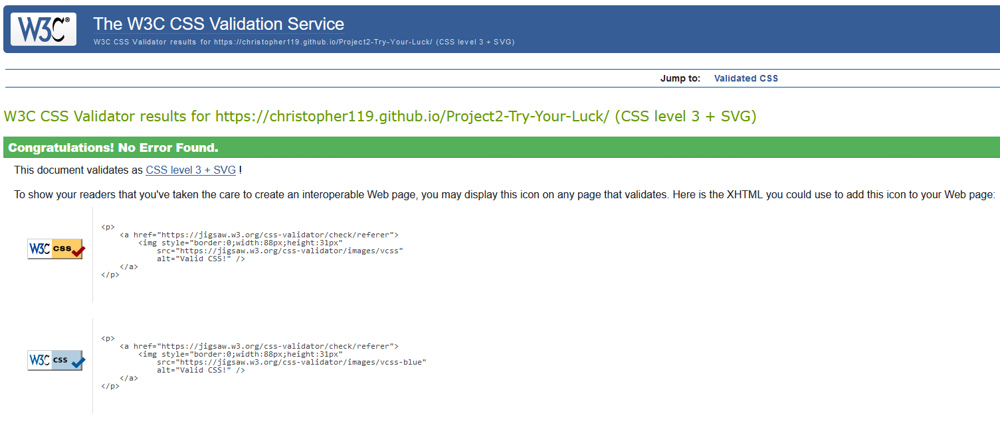

## JS

I have run the JavaScript through the JSHint validation and it is fully valid. 
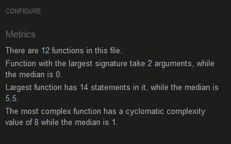

## Lighthouse

I have tested the webpages performance with Lighthouse. 
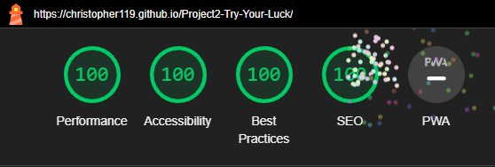

# Bugs

Any and all bugs have been found and removed. 
Notable bugs included: 
1. A calculation error that would produce an unexpected result and cause rolls to fail. 
This was an error with my if/else statements in the caclulateLuck function, a simple fix. 
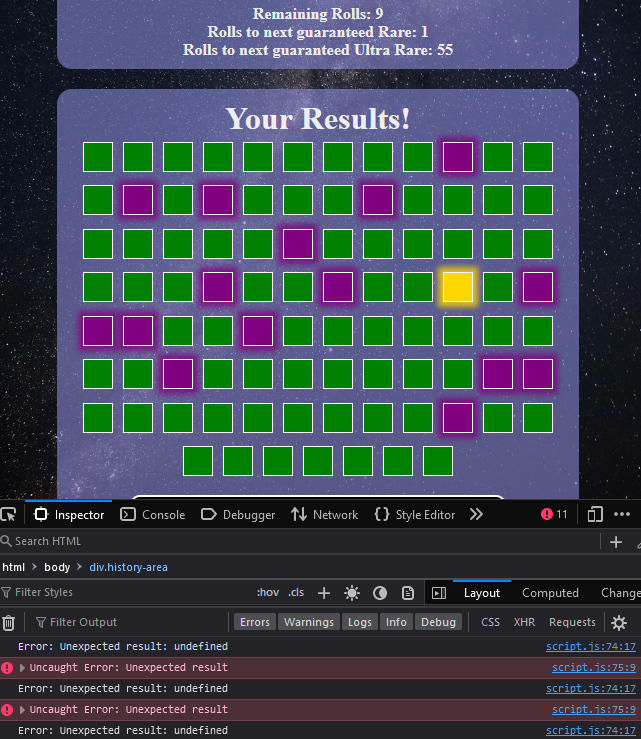

2. Counters going into negative values. This could occur for both the overall counter and the rare counter. 
Simply required a check in the code to prevent rolling past 0. This would sometimes happen if Ultra Rares dropped when a Rare was guaranteed as Ultras take priority.
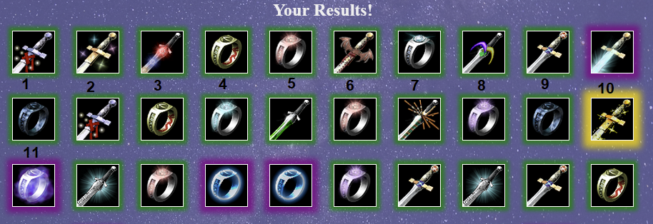 

3. Errors with divs not correctly loading the reward image resulting in blank or coloured squares. 
This was an error with the pathing url provided.

4. Errors with divs displaying the wrong rarity of image.
This was solved by separating the containing array into a blank array that was then populated by the correct rarity results depending on what was rolled. 
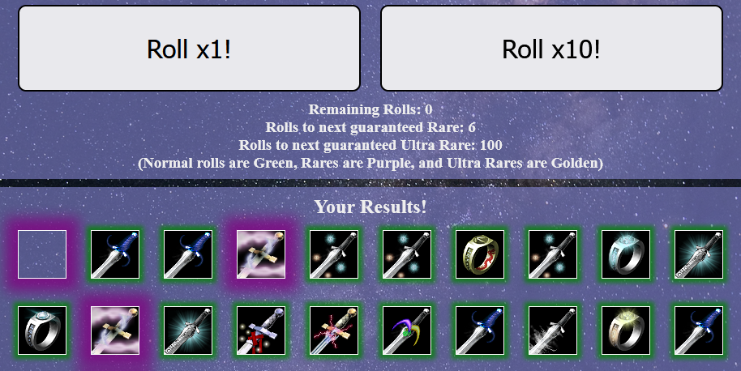

# Deployment

The site has been deployed to GitHub pages. In order to deploy the site: 
1. I navigated to the `Settings` tab of the Repository. 
2. I navigated to the `Pages` menu. 
3. In the `Source` dropdown options I selected `main` for the branch option. 
4. I left the `/root` option as the default option. 
5. I saved my changes. 

GitHub deployed my website, it was live a few minutes later. 
The live link can be found here - https://christopher119.github.io/Project2-Try-Your-Luck/

# Credits

## Content

The glow effect used for the rewards was found here: 
https://wpshout.com/snippets/css-glow-effect/ 
 
Use of a dialog box as a modal was adapted from here: 
https://blog.webdevsimplified.com/2023-04/html-dialog/ 

Initially I used an array to store all the reward images and then randomly selecting one. This has since been refactored and changed but the initial concept was adapted from here: 
https://stackoverflow.com/questions/64993980/adding-a-random-background-image-in-css-using-javascript 
 

## Media

The night stars background used used for the site was found here: 
https://www.pexels.com/photo/stars-1257860/ 
 
The icons used for the various rewards were found here: 
https://opengameart.org/content/flare-item-variation-60x60-only 