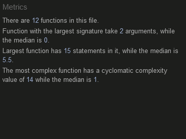

# TRY YOUR LUCK

___

This website is a simple lottery styled game. This site is targeted towards people who enjoy games of chance such as slots or gambling.

# Five UX Planes
## Strategy
Users want to be presented clear unambigous rules for the operation and mechanics of the game.
Users want to be shown the results of every roll they make.
Users want a clear indication in the difference of their roll results.
Users want to be able to see their roll progress.
Users will want to be able to quickly reset to try again.
Users want a simple, no-nonsense, presentation that doesn't distract from the main focus of the game.

## Scope
The site should be clean and simple and consistent across all devices.
The site should have clearly defined UI elements.
The site should present the rules and mechanics up front.
The site should have its main focus be on the two buttons for rolling.
The site should have counters to track all rolls.
The site should clearly present results of varying rarity.
The site should have a reset button.
The site should be unobtrusive but attractive.

## Structure
The achieve the above scope the structure of the webpage should consist of just one webpage.
The page will have a header with the title.
The page will have a footer with the creator and a link to their account.
The page will have multiple divs that are shown and hidden as needed.
It should display a simple welcome div that introduces the user to the rules and mechanics.
### Intro Div
This div should be hidden when the user progresses, displaying divs for the game and result areas.
This div should have a simple confirmation button for the user to progress after reading the rules.
### Game Div
The game div should have buttons and counters to roll and track a users number of rolls.
This div should have 2 buttons for single and multiple rolls.
There should be counters for overall rolls.
There should be counters to track number of rolls until guaranteed rarities.
### Result Div
The result area should be empty and populate with each result as a user presses buttons in the game div.
The result div should contain a reset button to set the game back to its beginning state.

## Skeleton
Wireframe of the game webpage on Desktop and Mobile devices
The design and flow of the website remains consistent and clean.
There is little change in the presentation of the website across various devices, save for some small resizing of elements.

## Surface
Presentation:
I wanted everything on the site to be clear and bright.
I chose a faded purple colour for the primary colour of the site.
I chose to use a white colour for the text to stand against the dark background.
The buttons follow a similar premise being primarily white and black to have suitable contrast.
I chose a starry night background as I felt it provided a similar feel to the lights of somewhere like Las Vegas wihtout being too bright or distracting.

# Features
## Header
The header simply contains the title of the Webpage/Game.

## Intro Div
The intro div acts as a welcoming splashscreen to the user.
It offers a quick overview of how the game works.
It has a button to start the game, at which point the div is hidden and the game divs are shown.

## Button Div 
The button div contains two buttons: Roll x1 and ROll x10.
Both buttons will execute JS code to pull a randomly selected reward or rewards and add them to the results div.
The button div also holds three counters.
One counter displays how many remaining rolls a user has.
Another displays how many rolls a user has until the next "Rare" drop they will receive.
The last counter displays how many rolls a user has until the next "Ultra Rare" drop they will receive.
Once the user has used all of their rolls a dialog will display informing them and asking them to reset the game.
This will also disable the both buttons to prevent further attempts.

## Results Div
This div is mostly empty at first, containing only a small header and a reset button.
As the user pressed the buttons in the Button-div this div will populate with the random rolls they have received.
The reset button will empty the div back to its default state and also reset the three counters in the button div.
If the user has prompted the dialog popup the Reset button will reactivate both Roll buttons.

## Footer
The footer quite simply contains my name as the creator and a GitHub icon linking to my account.  

## Features Left to Implement
All feautures were implemented as planned, however there are possible additions that could be made.
Possible future additions to the game may include:
1. A gallery page, which a user could use to view all possible results.
    This page could have a display of all rolls shadowed out, which then get unshaded when a user receives them through rolling.
2. A system to prevent receiving the same "Ultra Rare" drop twice in a row in one set of 100 pulls if the user was lucky enough to receive them.
3. The ability to bring up the intro div again if a user needs to double check the rules.

# Testing
There were multiple stages of testing as the project developed.
The first tests were simply to do with HTML and CSS styling and positioning to ensure a clean look on all devices.
JavaScript was tested repeatedly as it progressed.
Testing if divs were created when buttons were pressed.
Testing if divs were added to the correct div as children.
Testing if multiple divs could be added.
Testing if the counters for rolls and guarantees correctly decreased and reset per roll.
Testing if the Reset button would correctly reset the game to the beginning state.
Testing the calculations for luck by running through the 100 rolls multiple times.
Testing if checks for Rare and Ultra Rare guarantees were correctly functioning.
Testing if images loaded into divs correctly.
Testing if images loaded randomly correctly.
Testing if images could be seperated by "Rarity".

# Validating
## HTML
I have run the html through the validator and it is fully valid.

## CSS
I have run the css stylesheet through the validator and it is fully valid.

## JS
I have run the JavaScript through the JSHint validation and it is fully valid.

# Bugs
Any and all bugs have been found and removed.
    Notable bugs included:
        1. A calculation error that would produce an unexpected result and cause rolls to fail.
            This was an error with my if/else statements in the caclulateLuck function, a simple fix.

        
        2. Counters going into negative values. This could occur for both the overall counter and the rare counter.
            Simply required a check in the code to prevent rolling past 0.
        3. Errors with divs not correctly loading the reward image resulting in blank or coloured squares.
            This was an error with the pathing url provided.
        4. Errors with divs displaying the wrong rarity of image.
            This was solved by separating the containing array into a blank array that was then populated by the correct rarity results depending on what was rolled.

# Deployment
The site has been deployed to GitHub pages. In order to deploy the site:

I navigated to the Settings tab of the Repository
I navigated to the Pages menu.
In the Source dropdown options I selected main for the branch option.
I left the /root option as the default option.
I saved my changes.

GitHub deployed my website, it was live a few minutes later.

The live link can be found here - https://christopher119.github.io/Project2-Try-Your-Luck/

# Credits
## Content
The glow effect used for the rewards was found here:
    https://wpshout.com/snippets/css-glow-effect/
Using an array to store all the reward images and then randomly selecting one was adapted from here:
    https://stackoverflow.com/questions/64993980/adding-a-random-background-image-in-css-using-javascript
Use of a dialog box as a modal was adapted from here:
    https://blog.webdevsimplified.com/2023-04/html-dialog/

## Media
The night stars background used used for the site was found here:
    https://www.pexels.com/photo/stars-1257860/
The icons used for the various rewards were found here:
    https://opengameart.org/content/flare-item-variation-60x60-only